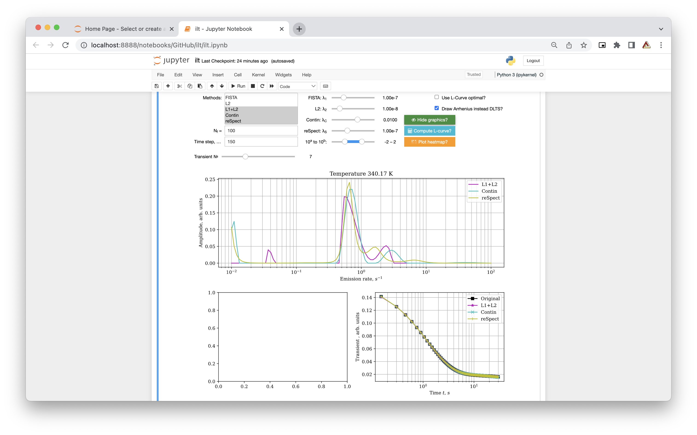

# Inverse Laplce Transform for Deep-Level Transient Spectroscopy

This repository contains code for analysing DLTS and Laplace DLTS data using different regularisation approaches to produce reliable results. Arrhenius plot option available to plot temperature swept data.

## Classic DLTS
The time-window concept proposed by D. Lang is the reason why classic DLTS is very sensitive to the small concentration of deep traps even with a low SNR (signal-to-noise ratio). But the main drawback of this approach is the inability to deconvolute the signal of two overlapped traps. 

## Laplace DLTS
So instead of setting the time window and searching for the peaks, regularization is imposed and brings a full emission rate picture for one transient. This gives an increase in trap separation but higher SNR is needed. Higher SNR can be achieved by averaging many transients (SNR $\propto$ $\sqrt{N}$, where $N$ – number of averaged transients).

### Used algorithms
Multiple algorithms are used to increase the reliability of results:
* python version of Contin – Fast and reliable algorithm. [Original code](https://github.com/caizkun/pyilt) was written by [caizkun](https://github.com/caizkun). 
* [FISTA](https://github.com/JeanKossaifi/FISTA) – Used to obtain sparse solutions. Works well when opposite sign traps are present in transient.
* pyReSpect – imported algorithm from [shane5ul/pyReSpect-time](https://github.com/shane5ul/pyReSpect-time).
* Simple L2 and L1+L2 regularization.

(L-curve is used with Contin, L2 and reSpect for regularization parameter optimisation)

### Results
This notebook can be used to perform Laplace DLTS to `.DLTS` files in the data folder. Contin and pyReSpect will work in 99% of cases. L1, L1 + L2 and especially FISTA work well in the other 1% with different sign exponential decays [(example of FISTA probing mobile ions in perovskites)](https://doi.org/10.1103/PhysRevApplied.13.034018). 

    
  <i>Notebook working cell</i>

 

    
  <i>Results obtained using reSpect algorithm</i>

